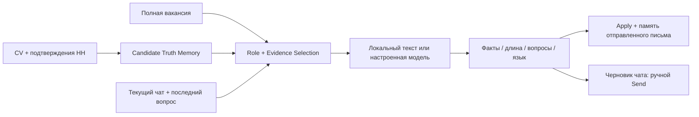

# Architecture · 3.9.5

## Единый путь текста в расширении

`candidate-seed.js` содержит датированные источники и факты. `candidate-truth.js` мигрирует профиль, хранит происхождение/статус, согласует изменения и отделяет память диалога. `relevance-engine.js` читает требования, определяет семейство роли, выбирает до пяти основных фактов, двух проектов и одного дополнительного факта. Отрицательная релевантность исключает нерелевантную биографию.

`context-reply.js` определяет последнее сообщение работодателя, ранее обсуждённые вопросы и пропуски. `chat-reader.js` ограничивает чтение активной панелью чата; боковой список переписок не является историей. Неизвестный автор не подменяется работодателем. Если разметка не даёт достаточно признаков, интерфейс показывает прочитанный текст и просит подтвердить его автора.

`writing-provider.js` — необязательный транспорт к явно настроенному Chat Completions API. `writing-background.js` связывает правила с существующими worker/storage. Старый canned `/triage` больше не выдаётся за анализ моделью.

## Standalone extension-first runtime

Core browsing features do not wait for `127.0.0.1:8080`.

- `universal-content.js` renders ✦ Apply from local page detection.
- `recruiter-chat-content.js` renders ✎ AI from the active chat DOM.
- `copilot-background.js` provides Candidate Truth/Profile/letter/chat logic inside the extension service worker.
- `setup-readiness.js` treats the local backend as optional for core Apply/Chat functions.
- `cpRepairSupportedTabs()` reconnects already-open HH tabs after install/startup when Chrome allows it.
- lightweight SPA watchdogs re-run page/chat detection after route/content changes.

The local .NET backend remains an advanced service for the autonomous queue/dashboard path.

## Места интеграции

- `cpPrepare` / `cpAutoApply`: полное описание → текущий профиль → новое письмо, а не устаревший application snapshot.
- `cpEnrichExistingPlan`: тот же путь для старого dashboard и advanced popup.
- `browserAutopilotApplyNext`: полная вакансия и новая память для письма. Серверная очередь/match score и существующие лимиты сохранены; backend ranking не переписан и автоматически не синхронизируется с произвольными изменениями профиля расширения.
- HH list quick apply: карточка даёт identity; текст для письма читается отдельно в неактивной вкладке, не переключая текущую. При ошибке загрузки письмо не отправляется.
- `cpResolve` / `cpAnswerCurrentChat`: актуальные личные факты плюс отдельный снимок CV/письма, использованный при отклике.

## Состояние и хранение

Профиль: Chrome local storage. Ключ модели: Chrome session storage, не content script и не экспорт Git. Память переписки: отдельная запись conversation. Черновик помечается `sent:false`; сохранение черновика не доказывает его отправку. Cover Letter Memory сохраняет фактический текст подтверждённого отклика и audit: vacancy hash, profile revision, fact IDs и источник генерации.

Кэш письма учитывает ID/полный текст вакансии, revision профиля и конфигурацию модели. Изменение фактов меняет ключ. Переключение чата/новое последнее сообщение отклоняет устаревший ответ. Подгрузка более ранней истории не считается новым последним сообщением.

## Границы

Чтение истории ограничено безопасным количеством шагов и доступным DOM. «Достигнут верх» без явного маркера не означает, что сервер отдал всю историю. В интерфейсе сохраняется признак неполной истории.

Проверка текста эвристическая: запрещённые неподтверждённые технологии, количества, известные противоречия, нерелевантный опыт, пустой/слишком длинный ответ. Произвольные семантические ошибки LLM полностью исключить этими проверками нельзя.

В Windows ZIP: `extension/` + опубликованный `backend/`. В Git: `browser-extension/` + существующий `src/`. Изменения .NET-бинарников отсутствуют; профиль/транспорт модели этой версии реализованы в расширении.
