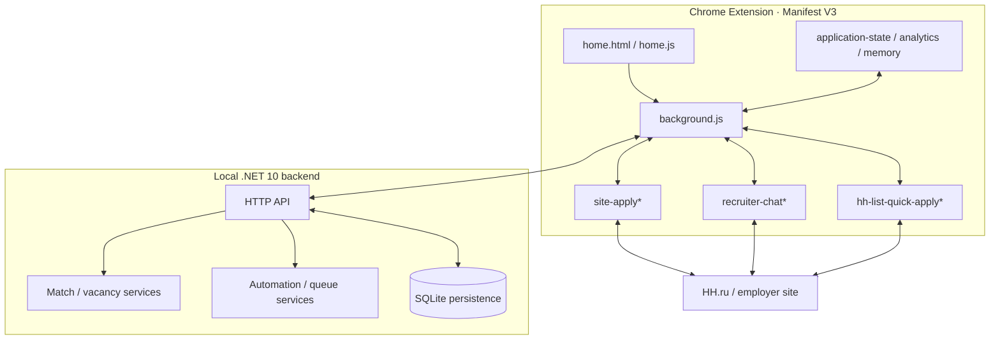
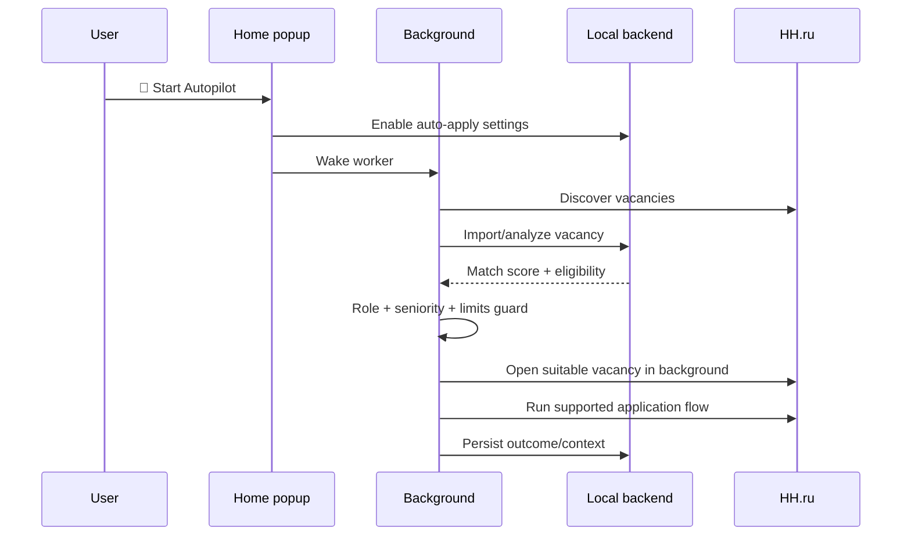

# Architecture — Violetta Apply Assistant 3.7.0

> **Design goal:** keep the user interface small while the context model behind it remains explicit, testable and recoverable.

## 1. System map



## 2. Source-of-truth layout

```text
browser-extension/            current extension source
src/JobSearchAssistant/       backend source
tests/                        backend + browser fixtures
scripts/                      CI/release verification
tools/                        local maintenance helpers
docs/                         project docs/assets/history
.github/workflows/             CI + packaging
```

Generated release binaries are intentionally excluded from Git.

## 3. Autopilot



Autopilot is a **user-started control surface over the existing automation pipeline**, not a parallel second engine.

## 4. Current-vacancy Apply

```text
JOB_DESCRIPTION
→ ✦ Apply
→ vacancy extraction
→ language / CV resolution
→ vacancy-specific letter
→ supported form/application executor
→ CONFIRMED | REVIEW_REQUIRED | FAILED
```

The application state machine prevents unrelated navigation from becoming the primary UX.

## 5. HH search-list quick apply

A trusted native user click on HH.ru **Откликнуться** pins the exact vacancy card and allows the helper to continue through a supported cover-letter modal.

Programmatic/autopilot clicks are intentionally separated from that trusted-click path to prevent duplicate execution.

## 6. Recruiter chat

Context model:

```text
active chat DOM
+ latest recruiter message
+ linked Application / Vacancy
+ CV used
+ Cover Letter Memory
+ recent thread memory
```

`✎ AI` uses DOM-first extraction and discards stale responses when the user changes conversation identity.

Recruiter Send is manual.

## 7. Persistence

The architecture preserves the existing application registry and backend persistence. The project does not introduce a second database for the newer extension features.

Key persisted context includes application identity, vacancy identity, CV selection, exact cover letter, timeline and follow-up state.

## 8. Safety gates

The executor stops rather than guesses on ambiguous required candidate decisions such as:

- salary expectations;
- visa/work authorization;
- legal/privacy declarations;
- contractual acceptance;
- unknown mandatory facts.

## 9. Packaging

`.github/workflows/package-windows.yml` builds a self-contained Windows backend from `src/JobSearchAssistant/`, then assembles it with `browser-extension/` and launcher files.

The source repository remains small and reviewable; generated runtime files are release artifacts.
