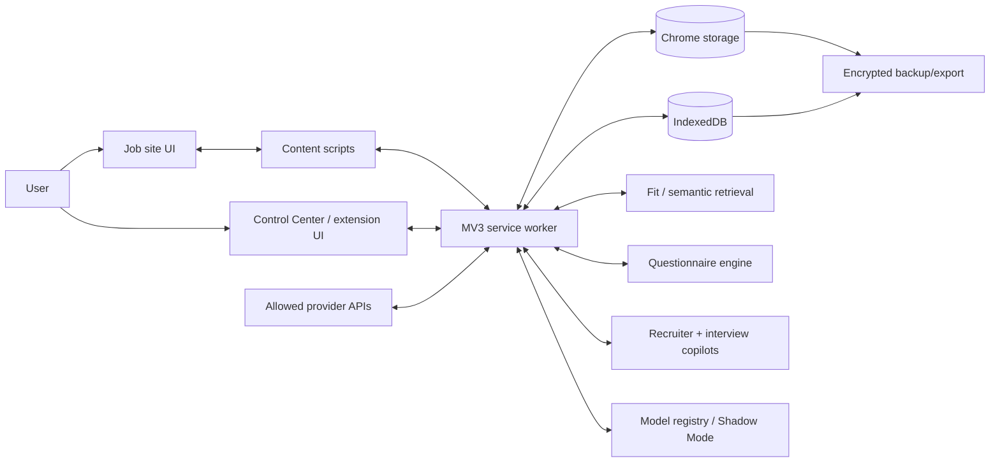
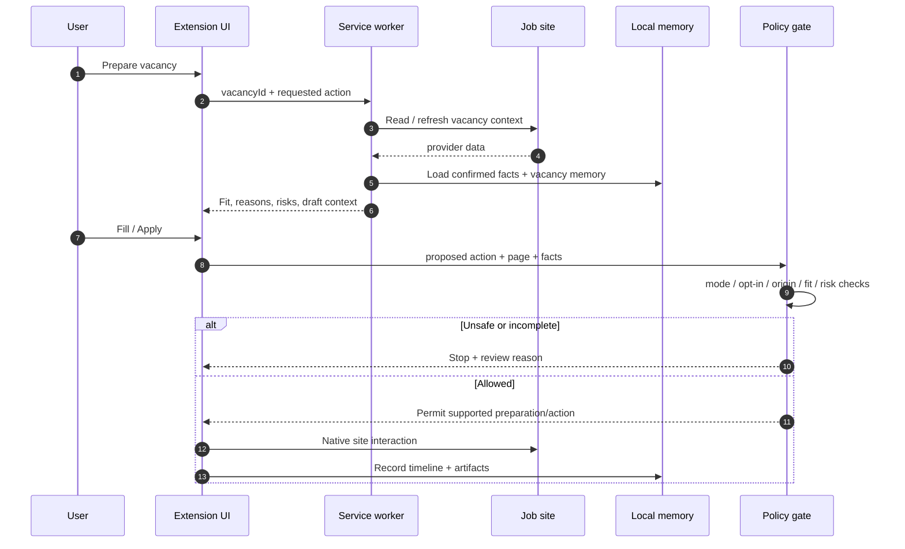
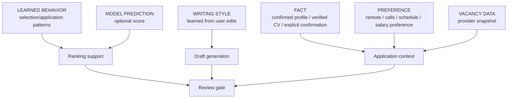
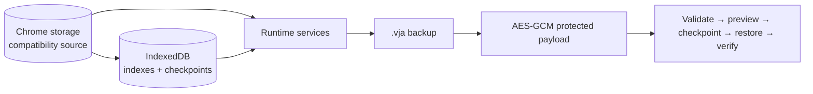
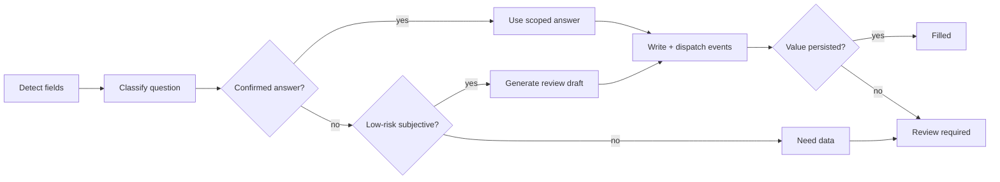
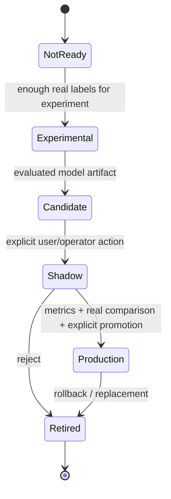
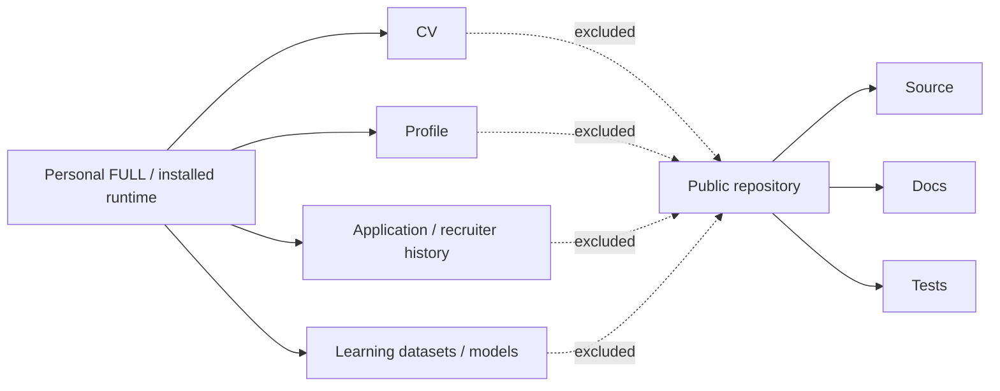

# Architecture · Архитектура

**Release:** 6.0.0 RC3  
**Status:** Release Candidate — automated validation exists; authenticated HH critical flow is still pending live acceptance.

This document describes the system boundaries that matter for correctness, privacy, data preservation and safe automation. It intentionally separates browser responsibilities, local data, optional model logic and the retained Windows runtime.

## 1. System context

### Responsibility split

| Layer | Responsibility | Must not do |
|---|---|---|
| Content scripts | Read page context, locate safe controls, fill supported fields | Invent missing vacancy/user facts |
| Service worker | Identity, orchestration, policy gates, persistence coordination | Bypass review/risk gates silently |
| Control Center | Queue, applications, analytics, settings, diagnostics, learning/model operations | Treat UI state as verified provider state |
| Storage | Preserve context, timeline, memory, checkpoints | Implicitly discard unknown schema fields |
| Intelligence | Fit, retrieval, optional candidate model output | Present heuristic/rule output as trained ML |
| Backup/restore | Export, validate, preview, checkpoint, restore | Restore unsupported future schema without rejection |

## 2. Application safety path

## 3. Truth taxonomy

The product distinguishes six data classes. This boundary is part of the safety contract, not a UI label.

A model prediction must never become a personal fact. A writing preference must never become professional history. Vacancy text must never become candidate experience.

## 4. Storage model

Chrome storage remains the compatibility source for existing runtime data. IndexedDB `violetta-product` provides indexed mirrors/checkpoints for selected collections and product operations. This is an additive architecture: RC3 does not claim a fully transactional migration of all runtime state into IndexedDB or `%LOCALAPPDATA%`.

### Data-preservation rules

- Migrations are additive where practical.
- Unknown fields are preserved instead of silently dropped.
- Future unsupported schemas are rejected.
- Restore creates/uses a rollback checkpoint and pauses automation.
- A failed index rebuild must not erase the source record.
- Full cross-store atomicity is not claimed in RC3.

## 5. Questionnaire engine

Core modules classify fields, resolve confirmed/reusable memory, create safe drafts when allowed, write supported values, dispatch browser events and verify that reactive pages did not reset the value.

Unsupported custom controls fail to review instead of triggering arbitrary clicks.

## 6. Learning and model lifecycle

Preference prediction and employer engagement are separate targets. Candidate models run in Shadow Mode before any production promotion. A more complex model is not preferred merely because it exists.

See [ML_ARCHITECTURE.md](docs/ML_ARCHITECTURE.md), [MODEL_EVALUATION.md](docs/MODEL_EVALUATION.md) and [MODEL_OPERATIONS.md](docs/MODEL_OPERATIONS.md).

## 7. Provider adapters

| Provider | RC3 state | Validation boundary |
|---|---|---|
| HH / HeadHunter | Primary | Automated fixtures; critical authenticated flow pending |
| Habr Career | BETA | Adapter/DOM fixtures; not live validated |
| Avito Vacancies | BETA | Persistent search/detail controls, background full read, Fit/Calls, feminine letter with confirmed contacts, exact-chat one-message send; not live validated |
| External ATS | Experimental | Generic form support only; origin and field confidence matter |

Provider adapters should expose a consistent contract: page detection, vacancy identity, full vacancy extraction, application controls, questionnaire detection and status/chat surfaces where supported.

## 8. Windows runtime boundary

The FULL package retains the Windows backend binary/runtime inherited from RC2. C# source was not present in the supplied baseline used for RC3, so the backend was not rebuilt or independently .NET-tested in this pass.

The browser extension's current safety policy therefore must not be interpreted as proof that every legacy backend route has received the same audit.

## 9. Repository vs personal runtime

For exact privacy limitations, encryption scope and Git publication rules, see [PRIVACY_AND_DATA.md](docs/PRIVACY_AND_DATA.md).

---

# Кратко по-русски

Архитектура RC3 строится вокруг **Chrome MV3 extension**, где content scripts работают с конкретной страницей, service worker хранит идентичность вакансии и применяет policy gates, а Control Center объединяет очередь, отклики, аналитику, диагностику и learning/model operations.

Ключевой принцип: **пользовательский факт, предпочтение, стиль письма, выученное поведение, модельный прогноз и данные вакансии — разные типы данных**. Они не должны автоматически превращаться друг в друга.

Chrome storage остаётся совместимым источником runtime-данных. IndexedDB используется как дополнительный индекс/checkpoint слой; полный перенос всей памяти в него или в `%LOCALAPPDATA%` в RC3 не заявляется. Backup/restore предусматривает проверку схемы, preview, checkpoint, restore и verify.

Анкетный движок пытается использовать только подтверждённую/scoped память, безопасные review-drafts и проверяемое заполнение DOM. Неизвестные обязательные факты, юридические поля и неуверенные controls должны останавливаться на ручной проверке.

HH остаётся основным провайдером, но критический авторизованный workflow ещё должен пройти live acceptance. Habr Career и Avito Vacancies — BETA. Avito использует отдельный bundle и отдельную one-shot policy: одно явное нажатие **Письмо** разрешает одно сообщение после exact-vacancy/chat проверки, заполнения composer и verified send; фоновой массовой рассылки нет.
