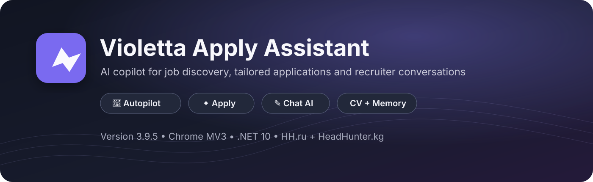
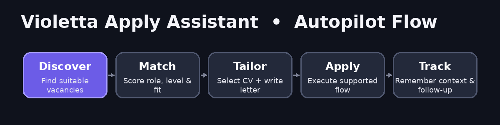

# Violetta Apply Assistant · 3.8.0

**Память кандидата → полная вакансия → релевантные факты → письмо или ответ в текущем чате.**

Windows-пакет с локальным .NET-сервером и расширением Chrome MV3. Версия 3.8 обновляет расширение и правила подготовки текста; опубликованные серверные EXE/DLL сохранены из 3.7.0, а не пересобраны.

## Основные действия

| Действие | Поведение |
|---|---|
| ✦ Apply | Анализ полного описания, выбор RU/EN PDF, короткое письмо, существующий поддерживаемый сценарий отклика. |
| 🚀 Автопилот | Сохраняет прежние фильтры и лимиты; перед письмом читает полную вакансию и использует актуальную память расширения. |
| Откликнуться в списке HH | Привязывает письмо к нажатой карточке. Если полное описание недоступно, не отправляет письмо по обрывку карточки. |
| ✎ AI → Проанализировать весь диалог | Читает активную переписку, определяет последнее сообщение работодателя и открытые вопросы. Создаёт черновик, но не нажимает Send. |
| Предпросмотр письма | В настройках можно проверить вакансию и увидеть выбранные факты без реального отклика. |

## Память CV и HH

Встроены данные из трёх предоставленных PDF и текста резюме HH, присланного владельцем 28 сентября 2026 года. AppXite и фриланс-разработка добавлены как **подтверждённые владельцем сведения**, не как независимо проверенное трудоустройство. Источники, даты получения, идентификаторы фактов и SHA-256 PDF сохранены.

Факты профиля и память переписки разделены. Фраза работодателя или AI-черновик никогда не становится глобальным фактом кандидата автоматически. Новое подтверждение проходит предварительный просмотр; конфликтующие сведения требуют выбора пользователя. Старые непроверенные импортированные факты архивируются, а собственные правки и CV пользователя сохраняются.

## Два режима подготовки текста

**Локальный режим включён по умолчанию.** Он выбирает подтверждённые факты под задачи вакансии и формирует ограниченный, короткий текст. Умеет отвечать на прямые вопросы об известных навыках, опыте и контактах. Это не скрытая большая языковая модель.

**Настроенная AI-модель** нужна для свободного редактирования, сложных технических ответов и более гибкого языка. В «AI и ответы → Модель» укажите совместимый Chat Completions endpoint, точный идентификатор модели и свой ключ. Передача выбранных фактов, вакансии и переписки требует отдельного согласия. Ключ хранится в памяти сеанса браузера; после полного перезапуска его нужно ввести снова. API может быть платным по тарифу вашего провайдера.

При недоступной модели показывается причина и, только когда это возможно, локальный фактический вариант. Кнопка «Улучшить мой текст» без модели не имитирует генерацию.

## Релевантность вместо биографии

Backend/.NET: клиентская разработка, соответствующий стек, один подходящий проект. Техподдержка/интеграции: AppXite, тикеты, API, SQL, логи и воспроизведение ошибок. QA: тестирование исправлений, API/данные и подтверждённые тесты проектов. Для технических писем не используются Crowne Plaza, ресепшен или преподавание. GitHub добавляется в технические письма и исключается из преподавания по умолчанию.

Задача — естественный, краткий и фактически обоснованный текст. **Гарантий прохождения ATS или «невидимости» для AI-детекторов нет.** Проверки текста — программные эвристики, а не доказательство безошибочности модели.

## Запуск

**Готовый Windows ZIP:** распаковать полностью. Для существующей установки использовать `UPDATE_EXISTING.cmd`, затем Reload у существующего расширения в `chrome://extensions` и обновить вкладки. Запустить `start-assistant.cmd`. При первой установке выбрать «Загрузить распакованное» → папку `extension` внутри Windows-пакета.

**Исходники GitHub:** расширение находится в `browser-extension/`, backend — в `src/JobSearchAssistant/`. Бинарники `backend/` не коммитятся. Исходники сервера в Windows ZIP не подменяют существующий `src/` вашего репозитория.

Локальный адрес сервера: `http://127.0.0.1:8080`. При проблеме запуска: `BACKEND_DIAGNOSTICS.cmd`. Базу не удалять.

## Публикация исходников

`Publish-Violetta-3.8.0.ps1 -Push` выбирает полный ZIP через окно выбора файла либо работает из распакованного пакета. Проверяет SHA-256 каждого публикуемого файла, чистоту рабочей папки, origin и ветку main. Копирует только исходники, тесты, документацию и служебные скрипты, проверяет коды завершения Git. Без `reset`, `clean` и принудительного push. Изменённые файлы резервируются вне репозитория.

**CV и встроенные факты попадут в исходники. При Public-доступе они будут публичны.**

## Документация

- [Архитектура](ARCHITECTURE.md) и [статус реализации](IMPLEMENTATION_STATUS.md)
- [Стратегия текста и памяти](docs/WRITING_STRATEGY_3.8.md)
- [Инструкция запуска](START_HERE.txt), [тестирование](TESTING_GUIDE.md), [поддержка сайтов](SUPPORTED_SITES.md)
- [Безопасность](SECURITY.md), [изменения](WHAT_CHANGED.md), [дальнейшие задачи](ROADMAP.md)

## Границы проверки

Регрессия использует локальные страницы Chromium и настоящие JS-модули расширения с подменёнными Chrome/HTTP API. Она не является тестом авторизованного аккаунта HH, внешней модели или запуска Windows EXE. Старые GitHub CI могут содержать проверки прежнего UI; добавлен отдельный workflow для новой памяти и чтения чата. Текущие публичные/приватные данные GitHub этой сборкой не менялись.
