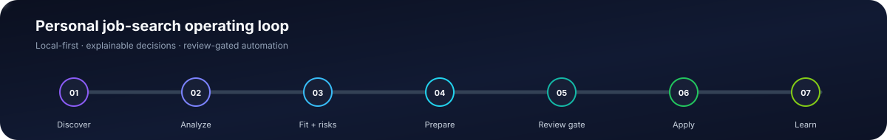
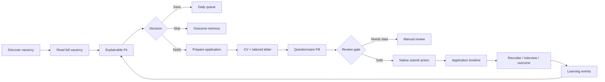
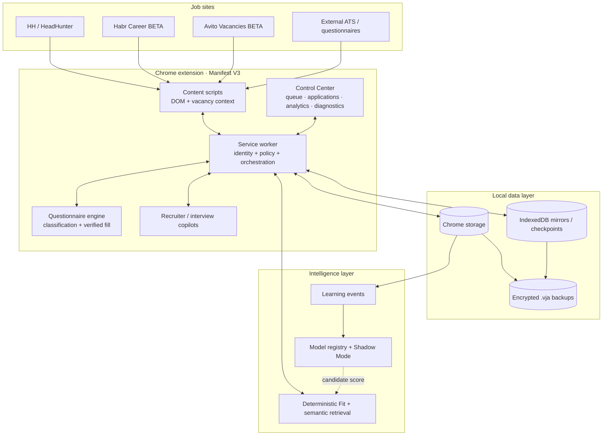
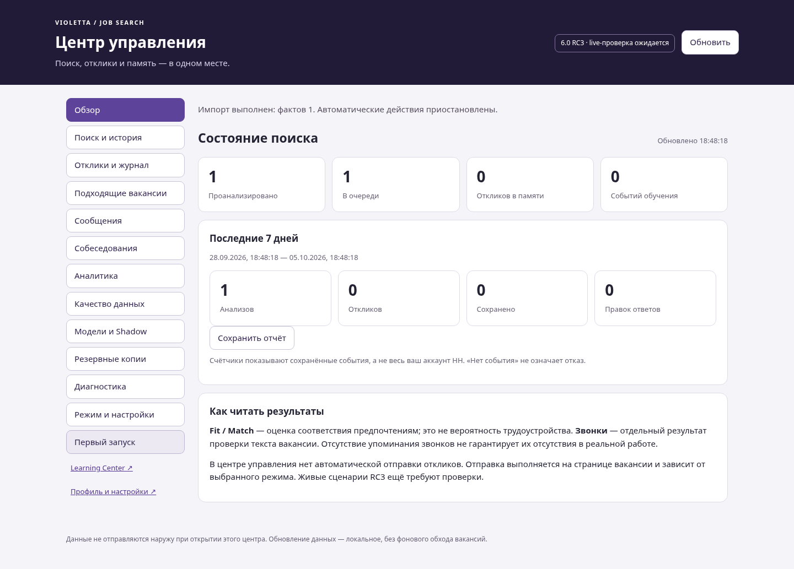
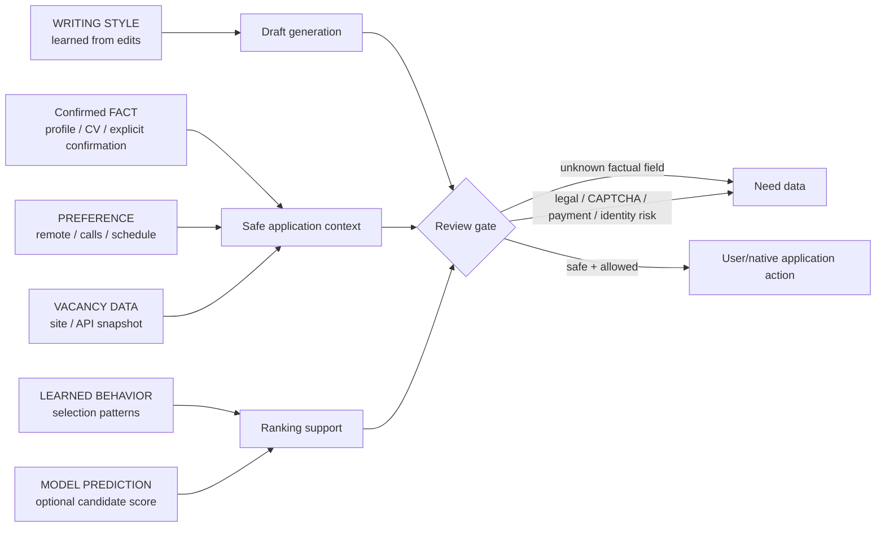
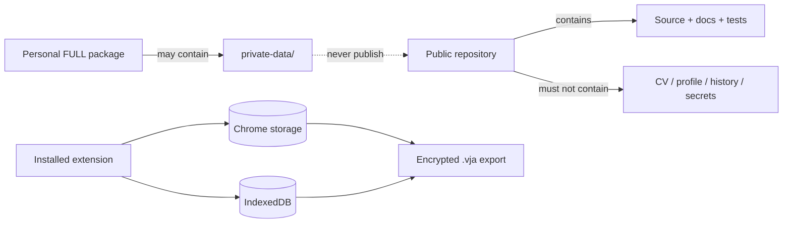
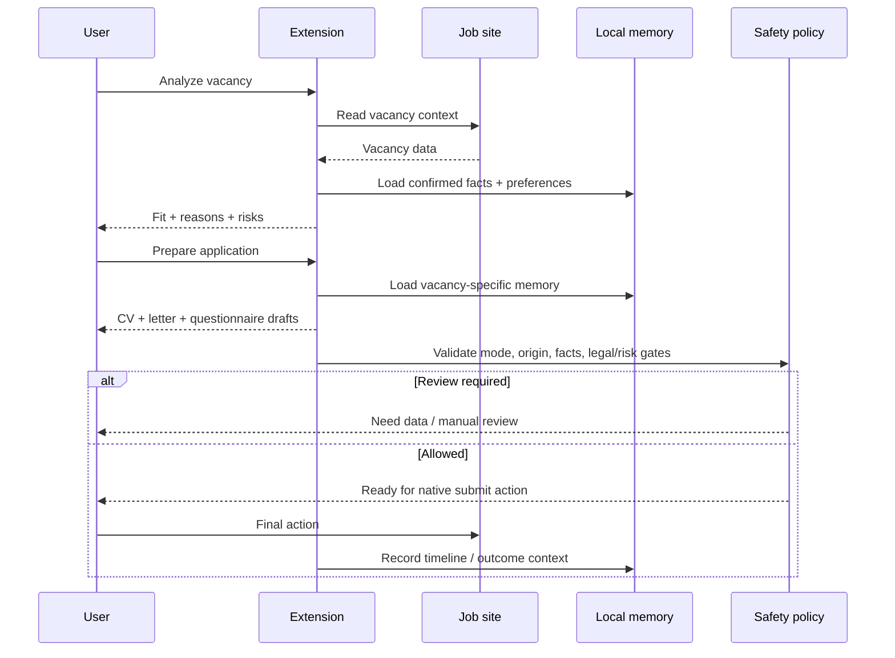

<div align="center">



# Violetta Apply Assistant

### Explainable, local-first job-search operating system
### Объяснимая локальная система для поиска работы и управления откликами

[](docs/RELEASE_NOTES_6.0.0.md)
[](ARCHITECTURE.md)
[](docs/HH_FEEDS_TEST_REPORT.md)
[](docs/HH_FEEDS_TEST_REPORT.md)
[](docs/LIVE_ACCEPTANCE_6.0.0.md)

**[English](#english)** · **[Русский](#русский)** · [Architecture](ARCHITECTURE.md) · [Docs](docs/README.md) · [Testing](docs/HH_FEEDS_TEST_REPORT.md) · [Privacy](docs/PRIVACY_AND_DATA.md)

</div>

> [!IMPORTANT]
> **6.0.0 RC3 is a Release Candidate, not Final Production.** Automated suites pass, but the critical authenticated HH workflow has not yet been live-validated in the user's installed browser. Habr Career and Avito Vacancies remain **BETA**. See [Live Acceptance](docs/LIVE_ACCEPTANCE_6.0.0.md).

---

# English

## HH homepage collections

The **For you / Near home / Part-time / Shift work / Remote work** feeds now use the same card Analysis, Match, Calls and **Apply + letter** flow as search. **Analyze page** processes loaded cards in the active collection; it does not send applications or automatically traverse every page. See [feed behavior and boundaries](docs/HH_FEEDS.md).

## What this project is

Violetta Apply Assistant is a personal job-search operating system built around a browser extension and local product services. It keeps vacancy analysis, application context, questionnaire memory, recruiter communication, outcome tracking, learning signals and model operations in one workflow.

The design goal is not “apply everywhere”. The goal is to make each decision **traceable, vacancy-specific, privacy-aware and reviewable**.

### Product principles

- **Correctness before automation** — missing vacancy data or missing personal facts fail safely.
- **Explainability before scores** — Fit includes reasons and risks; Calls is tracked independently.
- **Facts are not predictions** — confirmed facts, preferences, learned behavior and model output are separate domains.
- **User-controlled submission** — Assist prepares; final submission remains review-gated unless Autopilot is explicitly enabled and policy allows it.
- **Local-first memory** — personal runtime data stays in browser/local storage by default; public source packages exclude private profile/CV data.
- **Evidence-driven learning** — rules are not called ML; personal models require real labels and are evaluated before promotion.

## System workflow



## Capability map

| Area | Current RC3 capability | Safety / boundary |
|---|---|---|
| **Vacancy intelligence** | Single + batch analysis, exact vacancy identity, full-reading fallback, Fit reasons/risks | Fit is not hiring probability |
| **Avito Vacancies BETA** | Persistent card/page controls, background full read, Calls/Fit, feminine vacancy-specific letter, one-click native chat fill + send | One explicit **Letter** click authorizes one message; exact-chat and send verification; not live validated |
| **Calls classification** | Calls / No Calls / Unknown, stored separately from Fit | Unknown is preserved instead of guessed |
| **Application preparation** | Vacancy-bound context, CV selection, tailored cover letter, queue actions | Application stays bound to vacancy identity |
| **Questionnaires** | Text, textarea, native selects/radios/checkboxes, selected ARIA controls, verified writes | Unsupported/ambiguous controls remain review-required |
| **Answer memory** | Semantic category, scope, company, confidence, source, confirmation, edit history | Vacancy-specific answers do not silently leak to other companies |
| **Recruiter copilot** | Context-aware drafts and follow-up support | No silent message sending |
| **Interview support** | Vacancy-based preparation and practice | Suggestions remain factual and reviewable |
| **Outcomes & analytics** | Application timeline, CV/letter performance, sample-size-aware strategy analytics | Correlation is not presented as causation |
| **Learning & models** | Real-label training path, model registry, Shadow Mode, rollback | No bundled fake personal model; embeddings/GB are not claimed complete |
| **Operations** | Backup/restore, diagnostics, migrations, release hashes | Native/live validation boundaries are documented |

## Architecture at a glance



For trust boundaries, storage compatibility, worker responsibilities and migration constraints, see [ARCHITECTURE.md](ARCHITECTURE.md).

<details>
<summary><strong>Control Center preview</strong></summary>



</details>

## Truth & safety model



The system must not fabricate employers, dates, years of experience, certifications, citizenship, legal status, education, salary history, professional achievements or commercially used technologies.

## Automation modes

| Mode | Behavior |
|---|---|
| **Manual** | User explicitly initiates application actions. |
| **Assist** | Analyze, prepare and fill; final submission stays with the user. **Recommended for RC3.** |
| **Autopilot** | Explicit opt-in only, approved categories, policy checks, high Fit threshold and daily limit. |

Autopilot stops on unknown required facts, legal/work-authorization questions, CAPTCHA, suspicious external domains, payment requests, identity verification or unexpected upload requests.

## Data & privacy



The public GitHub package is designed to exclude private CV/profile/runtime data. The personal FULL package is **not** a repository artifact and must not be published. Full details: [Privacy & Data](docs/PRIVACY_AND_DATA.md).

## Release quality

| Check | RC3 result | Meaning |
|---|---:|---|
| Node test suite | **400 / 400** | JS unit/integration coverage with controlled dependencies |
| Python suite | **34 tests** | FULL: 34 passed; source-only: 27 passed, 7 release-plan tests skipped |
| Browser DOM suite | **102 / 102 assertions** | Chromium fixtures; not authenticated HH production traffic |
| HH homepage/feeds suite | **30 / 30 assertions** | Dynamic collections, card identity, full analysis and one-click fixture submission |
| Worker authorization | **19 / 19 assertions** | Mode, opt-in, origin, one-shot intent, Fit and risk gating |
| Live authenticated HH critical path | **NOT LIVE VALIDATED** | Required before Final Production |
| Habr application flow | **BETA / NOT LIVE VALIDATED** | Fixtures only |
| Avito vacancy workflow | **19 / 19 fixture assertions · BETA** | Persistent controls, Fit/Calls, exact native chat, fill/send verification; no authenticated account |
| Windows/.NET rebuild | **NOT RUN** | C# sources were not present in the supplied baseline |

See the current matrix in [HH_FEEDS_TEST_REPORT.md](docs/HH_FEEDS_TEST_REPORT.md) and the 52-point implementation matrix in [IMPLEMENTATION_STATUS.md](IMPLEMENTATION_STATUS.md).

## Quick start

### Development / repository installation

1. Clone the repository. In the GitHub tree the extension lives in `browser-extension/`; in the personal FULL package it lives in `extension/`.
2. Open `chrome://extensions`.
3. Enable **Developer mode**.
4. Choose **Load unpacked** and select `browser-extension/`.
5. Open the extension and complete/verify the candidate profile.
6. Keep automation in **Assist** until the critical live acceptance flow is completed.

### Updating an existing installation

Back up first. Replace the extension source in the **same directory** used by Chrome, then click **Reload** on the existing extension card. Then reload already-open HH tabs so they receive the new content scripts. Avoid deleting and reinstalling the extension unless you intentionally want a new extension storage scope.

## Avito Vacancies BETA

On Avito vacancy search pages the extension adds **Analysis**, **Letter**, Fit and Calls controls to detected cards. **Analyze page** processes visible cards with bounded concurrency. The full vacancy is read in an inactive background tab and the tab is closed after extraction.

The injected controls remain visible when Avito shows its native hover actions. One explicit **Letter** click reads the exact vacancy, prepares a concise message from confirmed CV/profile facts, enforces feminine Russian candidate grammar, appends the confirmed Telegram/email contacts, activates Avito’s native **Write** control, verifies the matching chat, fills the composer and sends that one message. The action is bounded and vacancy-scoped. If the first automatic attempt cannot verify the exact chat/composer/send state, the saved-letter window exposes **Send to chat**: it retries the exact native chat, fills and sends the edited text, and closes only after confirmed send. Avito remains BETA and is not authenticated-live-validated. See [AVITO_VACANCIES_BETA.md](browser-extension/AVITO_VACANCIES_BETA.md).

## Repository layout

```text
.github/                 CI workflows
browser-extension/       Chrome MV3 extension
src/                     local/product services and shared source
docs/                    engineering and user documentation
scripts/                 release/migration/operational scripts
tests/                   Python/browser/integration suites
tools/                   release, hygiene and ML utilities
ARCHITECTURE.md           system-level architecture
IMPLEMENTATION_STATUS.md  52-point engineering status
README.md                 product entry point (EN + RU)
```

Repository packages must not include release ZIPs, private runtime data, secrets, databases, logs, `node_modules`, compiled binaries or personal backups. See [Repository Layout](docs/REPOSITORY_LAYOUT.md).

## Documentation map

| Topic | Document |
|---|---|
| Documentation index | [docs/README.md](docs/README.md) |
| Architecture | [ARCHITECTURE.md](ARCHITECTURE.md) |
| Product capabilities | [FEATURES.md](docs/FEATURES.md) |
| User workflow | [USER_GUIDE.md](docs/USER_GUIDE.md) |
| Privacy & personal data | [PRIVACY_AND_DATA.md](docs/PRIVACY_AND_DATA.md) |
| Learning system | [LEARNING_SYSTEM.md](docs/LEARNING_SYSTEM.md) |
| ML architecture | [ML_ARCHITECTURE.md](docs/ML_ARCHITECTURE.md) |
| Model evaluation | [MODEL_EVALUATION.md](docs/MODEL_EVALUATION.md) |
| Model operations | [MODEL_OPERATIONS.md](docs/MODEL_OPERATIONS.md) |
| Backup & restore | [BACKUP_AND_RESTORE.md](docs/BACKUP_AND_RESTORE.md) |
| Diagnostics | [DIAGNOSTICS.md](docs/DIAGNOSTICS.md) |
| Supported providers | [SUPPORTED_SITES.md](SUPPORTED_SITES.md) |
| Testing | [TESTING_GUIDE.md](TESTING_GUIDE.md) |
| Exact RC3 test report | [TEST_REPORT_6.0.0.md](docs/HH_FEEDS_TEST_REPORT.md) |
| Live acceptance | [LIVE_ACCEPTANCE_6.0.0.md](docs/LIVE_ACCEPTANCE_6.0.0.md) |
| Release notes | [RELEASE_NOTES_6.0.0.md](docs/RELEASE_NOTES_6.0.0.md) |

<details>
<summary><strong>Release boundary — what RC3 does not claim</strong></summary>

- Authenticated HH end-to-end critical workflow is not yet live-validated.
- Habr Career and Avito Vacancies are BETA and not production-validated. Avito one-click sending is fixture-validated only and remains pending authenticated live acceptance.
- Full runtime migration from browser storage into a filesystem vault is not complete.
- Real embeddings are not implemented in the claimed production form.
- Gradient Boosting is not bundled/promoted as a trained personal production model.
- Windows/.NET backend was retained from RC2; it was not rebuilt from missing C# sources.

</details>

---

# Русский

## Подборки на главной HH

**«Для вас», «У дома», «Подработка», «Вахта», «Удалённая работа»** получают те же Analysis, Match, статус звонков и **«Отклик + письмо»**, что и поиск. **Analyze page** анализирует загруженные карточки активной подборки, не отправляя отклики и не обходя все страницы автоматически. [Поведение и ограничения](docs/HH_FEEDS.md).

## Что это за проект

Violetta Apply Assistant — персональная система для поиска работы, построенная вокруг браузерного расширения и локальных сервисов. Она связывает в один процесс анализ вакансии, подготовку отклика, заполнение анкет, память ответов, переписку с рекрутером, интервью, историю результатов и обучение на реальных действиях пользователя.

Цель системы — не «откликнуться как можно больше». Цель — сделать каждый отклик **привязанным к конкретной вакансии, объяснимым, контролируемым и безопасным по отношению к персональным данным**.

### Инженерные принципы

- **Корректность важнее автоматизации** — если данных не хватает, система не должна угадывать.
- **Объяснение важнее голого процента** — Fit показывает причины и риски; наличие звонков хранится отдельно.
- **Факт не равен прогнозу** — подтверждённые факты, предпочтения, выученное поведение и модельные оценки разделены.
- **Отправка остаётся под контролем пользователя** — Assist готовит и заполняет; финальное действие проходит review gate.
- **Local-first** — рабочая персональная память по умолчанию остаётся в локальном/browser storage; публичный source package не должен содержать CV и личный профиль.
- **ML только при наличии реального обучения** — правила и эвристики не называются ML; модель должна иметь реальные метки, метрики и возможность отката.

## Основные возможности

| Область | Что есть в RC3 | Граница |
|---|---|---|
| **Анализ вакансий** | Analysis, Batch, полное чтение, Fit, причины и риски | Fit не является вероятностью найма |
| **Авито BETA** | Постоянные кнопки карточки, Fit/Calls, женская форма письма, Telegram/email, открытие точного чата, вставка и отправка | Одно явное нажатие **Письмо** разрешает одно сообщение; exact-chat/send verification; live-проверки нет |
| **Звонки** | Calls / No Calls / Unknown отдельно от Fit | Unknown не подменяется догадкой |
| **Отклик** | Контекст конкретной вакансии, выбор CV, персональное письмо, очередь | Контекст не должен смешиваться между вакансиями |
| **Анкеты** | Текст, textarea, native select/radio/checkbox, часть ARIA-контролов, проверка сохранения значения | Неизвестный custom-контрол остаётся на ручной проверке |
| **Память ответов** | Категория, scope, компания, источник, confidence, confirmation, edit history | Ответ одной вакансии не переносится другой компании без основания |
| **Рекрутер** | Контекстные черновики и follow-up | Автоматическая отправка не является default |
| **Интервью** | Подготовка по вакансии и тренировка ответов | Ответы должны оставаться правдивыми |
| **Аналитика** | Timeline, сравнение CV/писем, роль, sample size и интервалы | Корреляция не объявляется причинностью |
| **Learning / Models** | Реальные learning events, registry, Shadow Mode, rollback | Нет фиктивной «готовой персональной модели» |
| **Эксплуатация** | Backup/restore, migrations, diagnostics, SHA-256 | Live-границы вынесены в отдельный отчёт |

## Как проходит отклик



## Режимы автоматизации

| Режим | Поведение |
|---|---|
| **Manual** | Все действия отклика запускаются пользователем. |
| **Assist** | Система анализирует, готовит и заполняет; финальная отправка остаётся пользователю. **Рекомендуется для RC3.** |
| **Autopilot** | Только после явного включения, для разрешённых категорий, при прохождении safety policy, Fit threshold и дневного лимита. |

Autopilot должен остановиться на неизвестных обязательных фактах, юридических вопросах, CAPTCHA, подозрительном внешнем сайте, оплате, подтверждении личности или неожиданной загрузке файла.

## Приватность

Публичный GitHub-репозиторий предназначен для кода, тестов и документации. CV, контакты, приватный профиль, история откликов, recruiter messages, learning datasets, backups и секреты не должны попадать в публичный source tree.

Персональный **FULL**-архив может содержать `private-data/` и поэтому **не предназначен для GitHub**. Подробно: [PRIVACY_AND_DATA.md](docs/PRIVACY_AND_DATA.md).

## Качество RC3

Текущий автоматический прогон проходит: **390/390 Node**, **34/34 Python** и **19/19 Avito Chromium fixture assertions**. Ранее зафиксированные HH/Control Center/worker наборы остаются в точном отчёте тестов. Это подтверждает покрытые сценарии в контролируемой среде, но **не заменяет живую авторизованную проверку HH**.

Пока критический HH workflow не пройден на установленном расширении, версия остаётся **Release Candidate**. Habr Career и Avito Vacancies — **BETA / NOT LIVE VALIDATED**.

## Работа с вакансиями Авито (BETA)

На странице поиска вакансий Авито расширение добавляет к карточкам **Analysis**, **Письмо**, Fit и статус звонков. Кнопка **Анализ страницы** последовательно читает видимые вакансии, открывая каждую только в неактивной фоновой вкладке и закрывая её после чтения.

Добавленные кнопки остаются видимыми и при наведении, когда Авито показывает собственную кнопку **Написать**. Одно явное нажатие **Письмо** читает точную вакансию, создаёт короткое профессиональное письмо по подтверждённым данным профиля/CV, приводит русские формы кандидата к женскому роду, добавляет подтверждённые Telegram и email, нажимает штатную кнопку **Написать**, проверяет, что открыт чат именно этой вакансии, вставляет текст и отправляет одно сообщение. Если первая автоматическая попытка не смогла подтвердить exact chat/composer/send, текст сохраняется, а окно показывает явную кнопку **«Отправить в чат»**: она повторяет открытие точного чата, вставку и отправку и закрывает окно только после подтверждения. Авито остаётся **BETA / NOT LIVE VALIDATED**. Подробности: [AVITO_VACANCIES_BETA.md](browser-extension/AVITO_VACANCIES_BETA.md).

## Быстрый запуск

1. Клонируйте репозиторий. В GitHub-дереве расширение находится в `browser-extension/`, а в персональном FULL — в `extension/`.
2. Откройте `chrome://extensions`.
3. Включите **Режим разработчика**.
4. Нажмите **Загрузить распакованное расширение** и выберите `browser-extension/`.
5. Откройте Violetta Apply Assistant и проверьте профиль/CV.
6. До живой приёмки используйте **Assist**.

Для обновления существующей установки сначала сделайте backup, затем замените файлы в **той же папке**, из которой Chrome уже загрузил расширение, и нажмите **Reload / Обновить** на существующей карточке. Без необходимости не удаляйте расширение и не создавайте вторую установку.

## Навигация по документации

- **[docs/README.md](docs/README.md)** — единая карта документации.
- **[ARCHITECTURE.md](ARCHITECTURE.md)** — архитектура, модули, trust boundaries и data flow.
- **[docs/USER_GUIDE.md](docs/USER_GUIDE.md)** — пользовательский workflow.
- **[docs/PRIVACY_AND_DATA.md](docs/PRIVACY_AND_DATA.md)** — приватность и данные.
- **[docs/BACKUP_AND_RESTORE.md](docs/BACKUP_AND_RESTORE.md)** — backup/restore.
- **[docs/LEARNING_SYSTEM.md](docs/LEARNING_SYSTEM.md)** — learning events и память.
- **[docs/ML_ARCHITECTURE.md](docs/ML_ARCHITECTURE.md)** — модельный слой и границы ML.
- **[docs/MODEL_EVALUATION.md](docs/MODEL_EVALUATION.md)** — метрики и promotion criteria.
- **[SUPPORTED_SITES.md](SUPPORTED_SITES.md)** — статус провайдеров.
- **[docs/TEST_REPORT_6.0.0.md](docs/HH_FEEDS_TEST_REPORT.md)** — точные результаты тестов.
- **[IMPLEMENTATION_STATUS.md](IMPLEMENTATION_STATUS.md)** — статус всех 52 требований.

<details>
<summary><strong>Что RC3 пока не заявляет</strong></summary>

- Критический workflow HH ещё не прошёл живую авторизованную приёмку.
- Habr Career и Avito Vacancies остаются BETA; Avito one-click message flow проверен только на контролируемой DOM-фикстуре, а не в живом авторизованном аккаунте.
- Полный filesystem vault для всей runtime-памяти не завершён.
- Production embeddings в заявленном полном виде не реализованы.
- Gradient Boosting не выдаётся за обученную персональную production-модель.
- Windows/.NET backend сохранён из RC2 и не пересобирался без C#-исходников.

</details>

---

<div align="center">

**Violetta Apply Assistant 6.0.0 RC3**  
Engineering status: **automated suites passing · live HH / Avito acceptance pending**

[Back to top](#violetta-apply-assistant)

</div>
