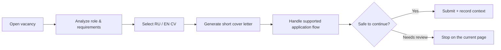
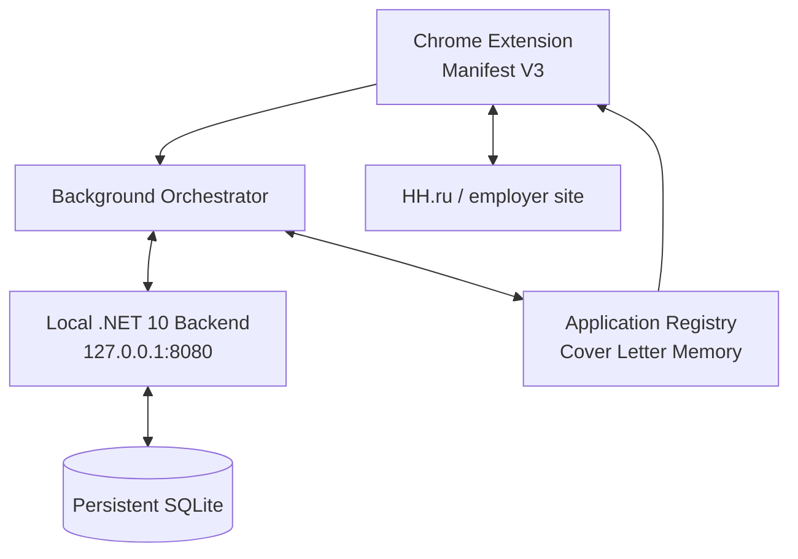

<p align="center">
  
</p>

<p align="center">
  
  
  
  
</p>

<p align="center">
  <a href="https://github.com/ViolettaNcl/job-search-assistant/actions/workflows/ci.yml">
    
  </a>
  <a href="https://github.com/ViolettaNcl/job-search-assistant/actions/workflows/site-apply-regression.yml">
    
  </a>
  <a href="https://github.com/ViolettaNcl/job-search-assistant/actions/workflows/package-windows.yml">
    
  </a>
</p>

# Violetta Apply Assistant

**AI copilot for job discovery, tailored applications and recruiter conversations.**

Violetta Apply Assistant combines a local .NET backend with a Manifest V3 Chrome extension. It helps discover suitable vacancies, tailor short application letters, run supported HH.ru application flows, keep application context, and prepare replies inside the active recruiter chat.

The product is designed around three rules:

> **Relevant over random. Truthful over impressive. Fast without losing context.**

---

## ✨ Product experience

<table>
<tr>
<td width="25%" align="center"><b>🚀 Autopilot</b><br><sub>Discover, score and apply to suitable roles after explicit start.</sub></td>
<td width="25%" align="center"><b>✦ Apply</b><br><sub>Run the application workflow for the vacancy already open.</sub></td>
<td width="25%" align="center"><b>✎ Chat AI</b><br><sub>Read the active recruiter conversation and draft a contextual reply.</sub></td>
<td width="25%" align="center"><b>🧠 Memory</b><br><sub>Remember the vacancy, CV and exact cover letter used.</sub></td>
</tr>
</table>

<p align="center">
  
</p>

---

## 🚀 Autopilot

Autopilot starts **only when the user presses the rocket button**.

It can:

- discover vacancies through the existing HH.ru browser workflow;
- score fit and seniority;
- prioritize remote IT roles;
- skip clearly unsuitable Middle / Senior / Lead / Principal / Staff / Architect / Head / Manager roles;
- select the appropriate RU/EN CV;
- prepare a short vacancy-specific cover letter;
- open suitable vacancies in background tabs;
- execute supported application flows;
- keep per-session and daily limits.

### Default target families

`C# / .NET` · `ASP.NET Core` · `Backend` · `Full-Stack .NET` · `QA / QA Automation` · `Technical Support`

<details>
<summary><b>Why the Autopilot is conservative</b></summary>

The goal is not blind mass application. A title keyword alone is not enough. Matching, seniority, role family and existing candidate facts are considered together.

Unknown or ambiguous required fields — salary expectations, visa/work authorization, legal/privacy declarations, contractual commitments — stop that application for review rather than inventing an answer.

</details>

---

## ✦ One-click Apply

On an opened supported vacancy, press **✦ Apply**.



The normal Apply path stays in the employer flow instead of redirecting to an internal extension screen.

---

## ⚡ HH.ru quick apply from search results

When the user presses HH.ru's native **Откликнуться** button on a vacancy card, the extension can attach a vacancy-specific cover letter for that exact vacancy without forcing the user to open the detail page first.

The shortcut is intentionally bound to the trusted user click. If HH.ru opens an ambiguous or unsupported form, the assistant stops rather than guessing another control.

---

## ✎ Recruiter Chat AI

Open the recruiter conversation you want to answer and use:

**✎ AI → 🧠 Проанализировать весь диалог и ответить**

The assistant can combine:

- accessible active chat history;
- the latest recruiter message;
- linked vacancy/application context when available;
- CV used for the application;
- the exact submitted Cover Letter Memory;
- recent thread context.

It then prepares a **draft** for the current conversation.

> Recruiter **Send remains manual**.

Other actions include:

- answer the latest message;
- answer all visible questions;
- improve the user's draft;
- suggest a relevant recruiter question;
- compact Russian quick replies.

---

## 📝 Human-style cover letters

Technical cover letters are intentionally:

- short;
- vacancy-first;
- grounded in confirmed experience;
- focused on matching projects and skills;
- free from irrelevant CV repetition.

For relevant IT roles they may include:

**https://github.com/ViolettaNcl**

Developer / QA letters prioritize real technical work instead of using unrelated hospitality experience as the main argument.

---

## 🧠 Application memory

Each application can retain the exact context that matters later:

```text
Vacancy
+ selected CV
+ exact cover letter
+ application state
+ timeline / follow-up
+ recruiter conversation link
```

That lets Chat AI answer later recruiter questions using what was actually sent for that vacancy instead of reconstructing the context from scratch.

---

## 🏗 Architecture



### Source layout

```text
browser-extension/            Chrome extension source
src/JobSearchAssistant/       .NET backend source
tests/                        .NET + browser/integration tests
scripts/                      verification and packaging helpers
tools/                        maintenance/update helpers
docs/                         requirements, assets and history
.github/workflows/             CI, CodeQL and Windows packaging
```

Generated Windows backend binaries, ZIP releases and test-output folders are **not source files** and are intentionally excluded from Git.

---

## 🖥 Local backend

The extension communicates with:

```text
http://127.0.0.1:8080
```

For a packaged Windows release:

```text
start-assistant.cmd
```

Diagnostics:

```text
BACKEND_DIAGNOSTICS.cmd
```

Local SQLite data is stored outside the release bundle under `%LOCALAPPDATA%\ViolettaApplyAssistant`.

---

## 🧪 Quality gates

| Layer | Coverage |
|---|---|
| Backend | .NET build + MSTest |
| Extension | Node syntax + unit/regression tests |
| Browser | Synthetic Chromium fixtures |
| Packaging | Windows artifact build + verification |
| Security | CodeQL |
| Live sites | Manual smoke test after major DOM changes |

> Synthetic tests validate logic and known fixtures. They do **not** guarantee every future production DOM variant on HH.ru or another ATS.

---

## 🔐 Safety model

The assistant does **not** invent:

- employers;
- years of commercial experience;
- qualifications;
- legal status;
- salary expectations;
- visa/work authorization answers.

Ambiguous high-risk required fields are review stops.

CAPTCHA/MFA bypass is not implemented.

---

## 📚 Documentation

| Document | Purpose |
|---|---|
| [`ARCHITECTURE.md`](ARCHITECTURE.md) | System architecture and execution flows |
| [`IMPLEMENTATION_STATUS.md`](IMPLEMENTATION_STATUS.md) | Implemented / partial / pending areas |
| [`SUPPORTED_SITES.md`](SUPPORTED_SITES.md) | Platform support and known limitations |
| [`TESTING_GUIDE.md`](TESTING_GUIDE.md) | Local + CI verification |
| [`WHAT_CHANGED.md`](WHAT_CHANGED.md) | 3.7.0 release changes |
| [`START_HERE.txt`](START_HERE.txt) | Windows usage/update notes |
| [`SECURITY.md`](SECURITY.md) | Security and privacy model |
| [`ROADMAP.md`](ROADMAP.md) | Next engineering priorities |

---

<p align="center">
  <b>Violetta Apply Assistant 3.7.0</b><br>
  <sub>Small interface. Strong context. Human-readable applications.</sub>
</p>
