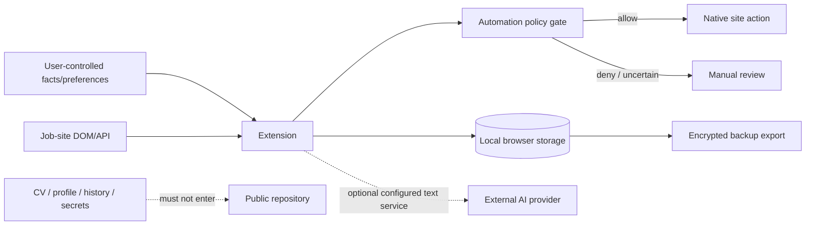

# Security · Безопасность

**Release:** 6.0.0 RC3  
**Security posture:** local-first, review-gated automation, explicit trust boundaries. This document is an engineering security model, not a security certification.

## Threat model

The project treats the following as high-impact failure classes:

- accidental publication of CV/profile/history/secrets;
- cross-vacancy or cross-company leakage of answers;
- fabricated personal/professional facts;
- unsafe automatic submission on an unexpected page/origin;
- destructive restore/migration behavior;
- secret/token leakage through diagnostics, logs or backups;
- treating an unvalidated provider/control as safe merely because a selector matched.

## Trust boundaries

## Security controls in RC3

| Control | Purpose | Boundary |
|---|---|---|
| Manual / Assist / Autopilot modes | Prevent unintended automation | Autopilot still depends on page/provider confidence |
| Worker authorization checks | Re-check mode, opt-in, origin, Fit and risk conditions | Does not prove every legacy backend path was audited |
| Fact/draft separation | Prevent fabricated candidate history | Depends on correct source labeling and user confirmation |
| Vacancy/company answer scope | Reduce cross-context leakage | User-marked reusable answers may intentionally cross scope |
| Review gates | Stop on legal/unknown/high-risk fields | Unsupported UI may require manual completion |
| Backup encryption | Protect portable `.vja` exports | Does not encrypt all Chrome runtime storage or the FULL package |
| Diagnostics redaction | Reduce secret/private-text exposure | User should still review exported diagnostics before sharing |
| Repository allowlist/hygiene | Keep private/binary runtime out of Git source update | Does not rewrite old Git history automatically |

## Stop conditions

Automation should stop and require manual review for:

- CAPTCHA or anti-bot verification;
- payment requests;
- identity verification / passport flows;
- unknown required factual fields;
- legal/work-authorization questions without confirmed data;
- unexpected file upload requests;
- suspicious/untrusted external origins;
- ambiguous controls where a safe target cannot be identified.

Do not bypass provider protection mechanisms.

## Secrets and private data

Never publish or attach to a public issue:

- CVs or private profiles;
- `.vja` backups;
- tokens, cookies, API keys or credentials;
- recruiter conversations or application history;
- raw learning datasets/model artifacts tied to personal history;
- the personal FULL package.

If a secret was committed previously, removing it from the current tree is not enough: rotate/revoke it at the provider and clean history separately if required.

## Cryptographic scope

SHA-256 release manifests provide **integrity checking**, not author identity. Encrypted backup payloads use authenticated encryption; this protection does not automatically extend to browser storage, LocalAppData copies or the unencrypted private files in FULL.

## Legacy Windows backend boundary

The Windows runtime carried forward from RC2 was not rebuilt from C# sources in this pass because those sources were not present in the supplied baseline. The extension's RC3 worker policy must therefore not be interpreted as a complete security audit of every legacy backend execution path.

---

# Кратко по-русски

RC3 проектируется по принципу **fail safe**: если неизвестен обязательный факт, не определён безопасный control, появился CAPTCHA/оплата/идентификация/юридический вопрос или origin вызывает сомнение, автоматизация должна остановиться.

Публичный GitHub не предназначен для CV, профиля, истории откликов, переписок, `.vja`, токенов и FULL-поставки. SHA-256 проверяет целостность, но не является цифровой подписью автора. Шифрование backup не означает, что вся Chrome-память или FULL автоматически зашифрованы.

До живой приёмки критического HH workflow рекомендуется режим **Assist**.
