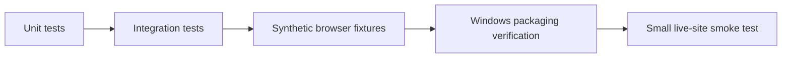

# Testing guide — 3.7.0

## Quality strategy



## 1. Extension tests

Node 22+:

```powershell
$tests = Get-ChildItem .\browser-extension\*.test.js | Select-Object -ExpandProperty FullName
foreach ($test in $tests) {
  node $test
  if ($LASTEXITCODE -ne 0) { throw "Failed: $test" }
}
```

## 2. Backend tests

```powershell
dotnet restore .\src\JobSearchAssistant\JobSearchAssistant.csproj
dotnet build .\src\JobSearchAssistant\JobSearchAssistant.csproj -c Release --no-restore
dotnet test .\tests\JobSearchAssistant.Tests\JobSearchAssistant.Tests.csproj -c Release
```

## 3. Synthetic browser regression

```powershell
python -m pip install playwright
python -m playwright install chromium
python .\tests\browser_e2e.py
```

These fixtures do not sign in to a real employer account and do not submit real applications.

## 4. Manual acceptance

- [ ] Extension/backend version = `3.7.0`
- [ ] Backend ready on `127.0.0.1:8080`
- [ ] RU/EN CV assets available
- [ ] ✦ Apply stays in employer flow
- [ ] HH list `Откликнуться` uses the same vacancy card
- [ ] High-risk unknown required field stops the flow
- [ ] ✎ AI drafts for the current recruiter chat
- [ ] Full-dialog analysis reads accessible history
- [ ] Chat A response never appears in Chat B
- [ ] Quick Replies remain compact
- [ ] 🚀 Autopilot starts/stops explicitly
- [ ] Senior/Lead/Manager roles are rejected by the junior guard
- [ ] Session/day limits are respected
- [ ] Duplicate applications are blocked
- [ ] Small live smoke test passes after major HH/ATS UI changes

## 5. GitHub Actions

| Workflow | Purpose |
|---|---|
| `ci.yml` | Backend build/tests + extension validation |
| `site-apply-regression.yml` | Extension/apply regressions + Chromium fixtures |
| `package-windows.yml` | Self-contained Windows release artifact |
| `codeql.yml` | CodeQL security analysis |

## 6. What should never be committed

- generated `backend/` runtime;
- `test-results/`;
- release ZIPs;
- logs/hashes;
- `.NET bin/obj`;
- local databases.

## 7. What passing tests do not prove

Automated tests do not permanently certify every production DOM variation, CAPTCHA/MFA path, custom ATS widget or third-party uptime.
