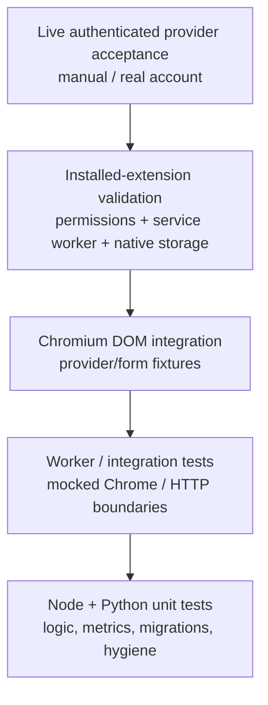
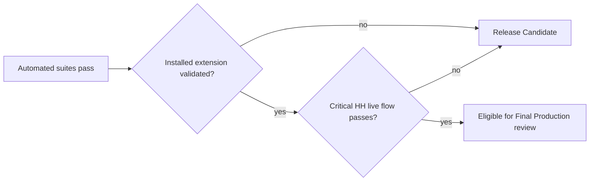

# Testing Guide · Руководство по проверкам

**Canonical result report:** [docs/TEST_REPORT_6.0.0.md](docs/TEST_REPORT_6.0.0.md)  
**Live acceptance:** [docs/LIVE_ACCEPTANCE_6.0.0.md](docs/LIVE_ACCEPTANCE_6.0.0.md)

The project distinguishes **unit/integration assertions**, **browser DOM fixtures**, **installed-extension checks** and **live authenticated provider acceptance**. A passing lower layer does not automatically promote a higher layer to PASS.

## Test pyramid



## Core commands

In the personal FULL package, browser source is `extension/`. In the GitHub source tree, use `browser-extension/` for extension files.

```bash
node --test extension/*.test.js
node tests/product_worker_600.cjs
node tests/worker_authorization_rc3.cjs
python -m unittest discover -s tests -p 'test_*.py' -v
python tests/browser_os_rc3.py
python tests/browser_e2e.py
python tests/browser_avito_beta.py
python tools/check-repo-hygiene.py
```

Chromium fixtures require Python Playwright and Chromium. Additional browser suites live under `tests/browser_*.py`; HH fallback coverage is in `tests/hh_read_fallback_3910.py`.

## What each layer proves

| Layer | Proves | Does not prove |
|---|---|---|
| Node/Python unit tests | Logic contracts and controlled integration behavior | Real provider DOM/account state |
| Worker integration | Authorization/policy behavior with mocked platform boundaries | Installed MV3 lifecycle correctness |
| Chromium fixtures | Real browser DOM/event behavior on controlled pages | Authenticated HH/Habr production behavior |
| Installed extension | Permissions, service worker, extension origin, native storage behavior | Site-wide/provider-wide correctness |
| Live acceptance | Critical real-user flow on current provider UI | Future DOM changes or all account variants |

## RC3 exact automated results

The current provider build records **388/388 Node**, **34/34 Python**, **16/16 Avito Chromium fixture assertions**, plus **19/19 worker authorization assertions** and focused HH retry scenarios. Both Chromium retry fixtures keep the current modal open for two native Send clicks, close it on the third, and include an unrelated stale “cover letter sent” label to verify vacancy-scoped confirmation. Earlier RC3 controlled-browser suites remain documented separately; the authenticated live HH flow is still not validated. These numbers describe different suites and must not be summed into a single “E2E test count”.

## Release gate



Windows publisher/verifier, native IndexedDB, .NET rebuild, Habr live application flow and authenticated Avito one-click chat send keep independent statuses. Missing tooling or missing source is **NOT RUN**, never PASS.

---

# Русский

Главное правило тестирования: **fixture ≠ установленное расширение ≠ живая приёмка**. Автоматические проверки RC3 покрывают много логики и DOM-сценариев, но не заменяют реальный авторизованный HH workflow.

До успешной live acceptance версия остаётся Release Candidate, даже если автоматические наборы полностью зелёные.
