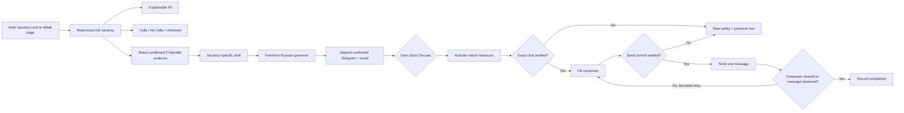

# Avito Vacancies BETA · Вакансии Авито

**Release state:** BETA · automated DOM fixture available · **NOT LIVE VALIDATED** on an authenticated Avito account.

This provider integration is isolated from the HH submission path. It adds exact-vacancy analysis and an explicit one-click chat message flow for Avito job listings. One user click on **Письмо** authorizes one message for one identified vacancy; it is not a background bulk-messaging mode.

## Workflow

## Search-page behavior

- detects Avito vacancy cards using provider-qualified vacancy identity;
- adds **Analysis**, **Письмо**, Fit and Calls controls;
- keeps the injected controls visible when Avito replaces the card footer on hover;
- supports bounded page analysis for the visible vacancy list;
- reads the full vacancy in an inactive background tab when the list snippet is insufficient, then closes that tab;
- keeps Fit and Calls independent;
- supports filters for strong Fit, Fit ≥ 80% and no-calls vacancies.

## One-click message behavior

After the user explicitly clicks **Письмо**, the extension:

1. resolves the exact Avito vacancy and reads the full description;
2. prepares a concise professional message from confirmed CV/profile evidence only;
3. normalizes Russian first-person forms to the feminine voice used by the candidate;
4. appends the confirmed Telegram and email stored in the local profile;
5. activates the native Avito **Написать** action for that vacancy;
6. waits for the matching chat and validates it against vacancy/company tokens;
7. fills the visible composer and dispatches native input/change events;
8. finds the live send control, sends one message and verifies completion;
9. retries the current send in a bounded loop when Avito re-renders the composer or ignores the first click;
10. records success only after the composer clears or the sent text appears in the chat.

If the exact chat, composer or send control cannot be verified, the extension stops rather than risking a message to another employer. The prepared text remains available in a fallback dialog for copying or a deliberate retry.

## Writing policy

- Russian cover letters use feminine candidate grammar (`готова`, `рада`, `работала` and related forms).
- The confirmed Telegram and email are appended when they exist in the local profile.
- Letters are vacancy-specific, concise and ATS-friendly in structure, but no claim is made that they can bypass ATS systems.
- Employer names, dates, commercial experience, certifications, legal status, achievements and technologies are never invented.
- Irrelevant experience is excluded; GitHub is included only for technical roles when confirmed in the profile.

The public source and standalone package do not embed the user's private contact values. Contacts come from the confirmed local profile/private import. The personal FULL package contains the user's private bootstrap and must not be published.

## Safety boundary

- one explicit **Письмо** click authorizes exactly one Avito message;
- no silent page-wide or background bulk sending;
- provider identity is stored as `avito:<itemId>` so numeric IDs do not collide with HH/Habr;
- tracking query parameters do not change canonical vacancy identity;
- CAPTCHA, identity verification, payment requests, unexpected uploads or an unverified chat stop the flow;
- Avito DOM/account states can change without notice, so the provider remains **BETA / NOT LIVE VALIDATED**.

## Validation

- Node provider/identity/writing/manifest contracts: `browser-extension/avito-vacancies-core.test.js`.
- Chromium fixture: `python tests/browser_avito_beta.py`.
- The fixture checks persistent hover controls, exact native Write activation, vacancy-specific feminine text, Telegram/email, composer fill, one-message send and detail-page parity.
- Live authenticated Avito validation: **pending**.
