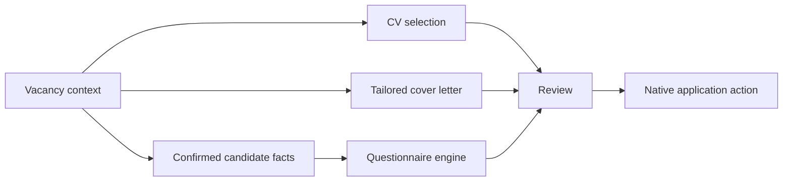

# Features · Возможности

This document lists user-visible capabilities together with their engineering boundaries. “Implemented” does not automatically mean “live-validated on every provider/account state”.

## Vacancy intelligence

- single vacancy analysis and batch analysis;
- exact provider vacancy identity;
- full vacancy reading with the existing background/API fallback paths;
- explainable Fit with reasons and risks;
- Calls / No Calls / Unknown stored independently from Fit;
- Save / Skip / queue decisions preserved by vacancy context;
- duplicate/repost support using provider identity and canonical fingerprints.

If full vacancy data cannot be read, the system should fail or fall back safely instead of inventing an analysis.

## Application preparation

Application artifacts are tied to the relevant vacancy. The product is designed to avoid generic cross-vacancy letter/answer reuse unless memory is explicitly reusable.

## Questionnaire engine

Supported/currently tested surfaces include:

- text inputs and textareas;
- native select controls;
- grouped radio options;
- checkboxes and limited multi-select paths;
- selected ARIA/custom control patterns with exact-match behavior;
- DOM input/change/blur dispatch;
- post-write verification for reactive reset;
- scoped answer memory with confirmation and edit history;
- safe subjective drafts marked for review;
- “Need data” behavior for unknown verifiable facts.

Arbitrary custom widgets are not guaranteed. An unsupported or ambiguous field should remain review-required rather than trigger a guessed click.

## Recruiter & interview support

- recruiter intent/context analysis from stored vacancy/application context;
- short/normal/detailed draft styles where supported by the existing copilot flow;
- follow-up scheduling/recommendations based on saved expectations;
- vacancy-based interview preparation and practice;
- no default silent send from Control Center.

## Timeline & analytics

The product keeps application/timeline context and supports strategy analytics grouped by roles, CV and letter characteristics. Sample size is surfaced; small samples should not drive strong automatic recommendations.

CV or cover-letter performance is evidence for recommendations, not proof of causal effect and not a reason for silent automatic switching.

## Learning & models

- learning events from real user behavior/corrections;
- separate preference and employer-engagement targets;
- model registry and model status management;
- Shadow Mode before promotion;
- rollback support;
- metric/ranking evaluation utilities;
- real-label provenance checks.

RC3 does not claim a bundled production Gradient Boosting personal model or a production external embeddings layer.

## Operations

- Manual / Assist / Autopilot modes;
- backup / restore workflow with preview/checkpoint/verification boundaries;
- migrations with future-schema rejection and unknown-field preservation where tested;
- diagnostics with redaction goals;
- release SHA-256 verification;
- repository hygiene/source allowlist.

## Русский

### Поиск и анализ

Analysis/Batch работают с конкретной вакансией. Fit содержит объяснение и риски, а Calls / No Calls / Unknown хранится отдельно. Если полное описание получить не удалось, система не должна подменять его выдуманным анализом.

### Отклик и анкеты

Контекст отклика привязан к вакансии: CV, письмо, questionnaire answers и timeline не должны незаметно смешиваться между разными компаниями. Подтверждённые ответы имеют priority над draft; неизвестные проверяемые факты должны оставаться `Need data`.

### Аналитика и learning

Результаты группируются по направлениям/CV/письмам с учётом размера выборки. Learning/model layer должен опираться на реальные labels; heuristics не выдаются за ML. Candidate model проходит Shadow Mode и ручное promotion/rollback.

Full implementation status: [../IMPLEMENTATION_STATUS.md](../IMPLEMENTATION_STATUS.md).
