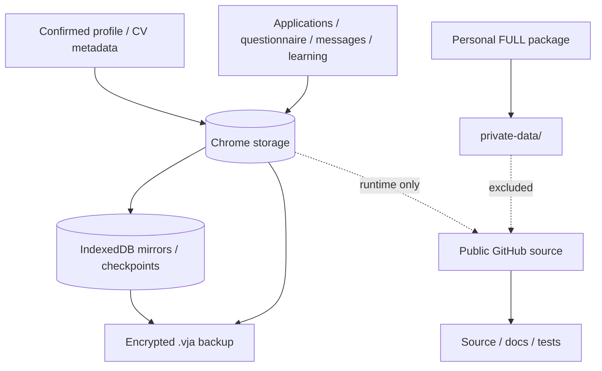

# Privacy & Data · Приватность и данные

**Release:** 6.0.0 RC3  
**Principle:** public source and personal runtime are separate products with separate data boundaries.

## Data classification

| Class | Examples | Source of truth | Public repository? |
|---|---|---|---|
| **FACT** | language level, education, confirmed contact | verified CV/profile or explicit user confirmation | No personal values |
| **PREFERENCE** | remote, calls, schedule, salary preference | explicit settings / confirmed preference | No personal values |
| **WRITING STYLE** | preferred length, tone, greeting style | user edits / writing memory | No private examples by default |
| **LEARNED BEHAVIOR** | save/skip/apply patterns | local learning events | No |
| **MODEL PREDICTION** | candidate preference score | model runtime | Model code may be public; personal artifacts/data are not |
| **VACANCY DATA** | provider snapshot, requirements, salary | job-site/API | Code/schema yes; personal browsing history no |

## Storage map

### Current RC3 placement

| Data | Location |
|---|---|
| Confirmed profile, contacts, current CV references | Browser working storage |
| Vacancy/application/questionnaire/recruiter/learning state | Browser storage under existing product keys |
| Selected indexed mirrors/checkpoints | IndexedDB `violetta-product` |
| Portable backup | Password-protected `.vja` export |
| Original personal files inherited from RC2 | Personal FULL under `private-data/` |
| Public source update | Source/docs/tests only; no personal runtime package |

## What encryption covers

Authenticated encryption protects the portable backup payload/checkpoints where implemented. It does **not** mean that:

- all Chrome storage is encrypted at rest by Violetta;
- `%LOCALAPPDATA%` copies are automatically encrypted;
- the personal FULL archive is encrypted;
- arbitrary text is guaranteed to be free of personal data before export.

Protect the Windows account, browser profile, device and backup password accordingly.

## External processing

Vacancy reading uses allowed provider surfaces and the existing provider/API logic. If an external text/model provider is configured, only send context that the user explicitly intends to process. Do not place provider credentials in README, issues, backups or diagnostics.

The RC3 documentation does **not** claim a production external embedding pipeline that sends CV/history to a third-party embedding service.

## Backup & restore privacy

Before sharing a backup or diagnostic artifact:

1. confirm it is the intended file;
2. keep the password out of the same communication channel where practical;
3. inspect diagnostics for unexpected private text;
4. never upload the personal FULL archive to a public repository or issue.

Restore should validate schema, preview intended changes, create/use a checkpoint, pause automation and verify restored collections.

## Git publication boundary

The GitHub update path is designed to exclude personal CV/profile/runtime files and compiled/release artifacts. It does not automatically purge sensitive data that might already exist in previous Git history.

If a credential was ever committed, revoke/rotate it independently of repository cleanup.

---

# Русский

## Что считается персональными данными проекта

К приватным данным относятся CV, контакты, подтверждённый профиль, ответы анкет, история откликов, переписки с рекрутерами, learning events, datasets, model artifacts, backups и секреты провайдеров.

**Публичный репозиторий предназначен для исходников, тестов и документации — не для пользовательской истории.** Персональный FULL может содержать `private-data/`, поэтому его нельзя публиковать в GitHub.

## Важная граница шифрования

Зашифрованный `.vja` backup не означает, что вся рабочая Chrome-память, LocalAppData и FULL автоматически зашифрованы. Защищайте устройство, учётную запись Windows, Chrome profile и пароль backup.

## Публикация в Git

GITHUB-UPDATE/allowlist не должен включать CV, profile, runtime history, databases, logs, binaries, `.env`, tokens или backups. Но он не очищает старую Git history. Если секрет уже когда-то был опубликован, его нужно отдельно отозвать/сменить.
