# Documentation · Документация

This directory is the engineering and operating manual for **Violetta Apply Assistant 6.0.0 RC3**. The main README is the product entry point; documents here contain the deeper contracts, limitations and operational procedures.

> **Release boundary:** RC3 is not Final Production until the authenticated HH critical path is live-validated.

## Documentation map

```mermaid
flowchart TB
    R[README.md\nProduct entry point] --> A[Architecture]
    R --> U[User operations]
    R --> D[Data & privacy]
    R --> T[Testing & release]
    R --> L[Learning & ML]

    A --> A1[ARCHITECTURE.md]
    A --> A2[DATA_MODEL.md]
    A --> A3[REPOSITORY_LAYOUT.md]

    U --> U1[USER_GUIDE.md]
    U --> U2[PRODUCT_CENTER.md]
    U --> U3[TROUBLESHOOTING.md]
    U --> U4[DIAGNOSTICS.md]

    D --> D1[PRIVACY_AND_DATA.md]
    D --> D2[BACKUP_AND_RESTORE.md]
    D --> D3[MIGRATION_5.2_TO_6.0.md]

    T --> T1[TESTING_GUIDE.md]
    T --> T2[TEST_REPORT_6.0.0.md]
    T --> T3[LIVE_ACCEPTANCE_6.0.0.md]
    T --> T4[RELEASE_PROCESS.md]

    L --> L1[LEARNING_SYSTEM.md]
    L --> L2[ML_ARCHITECTURE.md]
    L --> L3[MODEL_EVALUATION.md]
    L --> L4[MODEL_OPERATIONS.md]
```

## Start here

| If you want to… | Read |
|---|---|
| Understand the product quickly | [`../README.md`](../README.md) |
| Understand trust boundaries and modules | [`../ARCHITECTURE.md`](../ARCHITECTURE.md) |
| Install/update and operate the extension | [`USER_GUIDE.md`](USER_GUIDE.md) |
| Understand features and limits | [`FEATURES.md`](FEATURES.md) |
| Use HH homepage recommendations | [`HH_FEEDS.md`](HH_FEEDS.md) |
| Use Avito Vacancies BETA | [`../browser-extension/AVITO_VACANCIES_BETA.md`](../browser-extension/AVITO_VACANCIES_BETA.md) |
| Review privacy and personal-data handling | [`PRIVACY_AND_DATA.md`](PRIVACY_AND_DATA.md) |
| Create or restore a backup | [`BACKUP_AND_RESTORE.md`](BACKUP_AND_RESTORE.md) |
| Inspect tests and exact RC3 results | [`TEST_REPORT_6.0.0.md`](TEST_REPORT_6.0.0.md) |
| Perform the live HH acceptance | [`LIVE_ACCEPTANCE_6.0.0.md`](LIVE_ACCEPTANCE_6.0.0.md) |
| Understand learning / ML boundaries | [`ML_ARCHITECTURE.md`](ML_ARCHITECTURE.md) |
| Diagnose a problem | [`DIAGNOSTICS.md`](DIAGNOSTICS.md) + [`TROUBLESHOOTING.md`](TROUBLESHOOTING.md) |

## Documentation standards

Documentation should distinguish four different claims:

1. **Implemented in code** — source exists and has a defined contract.
2. **Automated-tested** — a controlled test exercised that contract.
3. **Live-validated** — a real authenticated provider/user flow was exercised.
4. **Production-ready** — required live acceptance and operational gates passed.

Do not collapse these statuses into a single “works” label. Unsupported providers, untrained models and unverified Windows/.NET paths must remain explicitly marked.

## Русская навигация

- Быстро понять продукт: [`../README.md`](../README.md), раздел **Русский**.
- Архитектура и границы системы: [`../ARCHITECTURE.md`](../ARCHITECTURE.md).
- Инструкция пользователя: [`USER_GUIDE.md`](USER_GUIDE.md).
- Авито BETA: [`../browser-extension/AVITO_VACANCIES_BETA.md`](../browser-extension/AVITO_VACANCIES_BETA.md).
- Приватность и личные данные: [`PRIVACY_AND_DATA.md`](PRIVACY_AND_DATA.md).
- Backup / Restore: [`BACKUP_AND_RESTORE.md`](BACKUP_AND_RESTORE.md).
- Точный отчёт тестов: [`TEST_REPORT_6.0.0.md`](TEST_REPORT_6.0.0.md).
- Живая приёмка HH: [`LIVE_ACCEPTANCE_6.0.0.md`](LIVE_ACCEPTANCE_6.0.0.md).
- ML / Learning: [`ML_ARCHITECTURE.md`](ML_ARCHITECTURE.md), [`LEARNING_SYSTEM.md`](LEARNING_SYSTEM.md), [`MODEL_EVALUATION.md`](MODEL_EVALUATION.md).

Текущая доработка главной HH: [HH_FEEDS.md](HH_FEEDS.md). Проверки этой сборки: [HH_FEEDS_TEST_REPORT.md](HH_FEEDS_TEST_REPORT.md).
