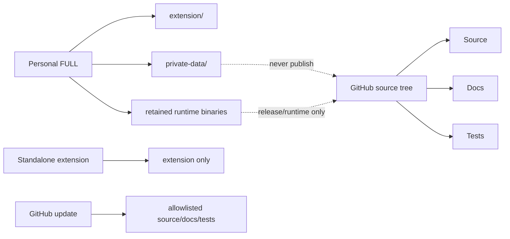

# Repository Layout · Структура репозитория

The public repository is a source tree, not a release dump or a personal runtime directory.

```text
.github/                 CI workflows
browser-extension/       Chrome Manifest V3 extension
docs/                    product, engineering and operating documentation
scripts/                 release / migration / operational scripts
src/                     existing source services kept by the repository
tests/                   Node / Python / Chromium suites and fixtures
tools/                   hygiene, release and ML utilities
ARCHITECTURE.md           canonical system architecture
IMPLEMENTATION_STATUS.md  canonical 52-point status matrix
SUPPORTED_SITES.md        provider validation status
TESTING_GUIDE.md          canonical testing model
README.md                 bilingual product entry point
```

## Source vs delivery packages



## Files that must not be committed

- `*.zip`, `*.exe`, `*.dll`, `*.pdb`;
- databases and runtime logs;
- `.env`, tokens, cookies, credentials and private keys;
- CVs, private profiles, recruiter/application history and `.vja` backups;
- personal learning datasets/model artifacts;
- `node_modules/`, `bin/`, `obj/`, `test-results/`, `artifacts/`, `coverage/`;
- nested packaged release folders.

`source-sync-manifest.json` and repository hygiene tooling define the intended safe publication surface for the RC3 source update. The publisher must not delete unknown existing repository content blindly and must not use force-push as a routine publication mechanism.

## Personal FULL structure

The FULL archive is intentionally different from the GitHub tree. It may include `extension/`, retained backend/runtime files, `private-data/`, scripts, tests, docs and release manifests. Treat it as a personal delivery artifact, not a Git source folder.

## Русский

Публичный GitHub должен содержать **исходники, документацию и тесты**, а не персональную поставку FULL. FULL может содержать `private-data/`, runtime binaries и локальные пользовательские файлы, поэтому его нельзя просто `git add .` в публичный репозиторий.
